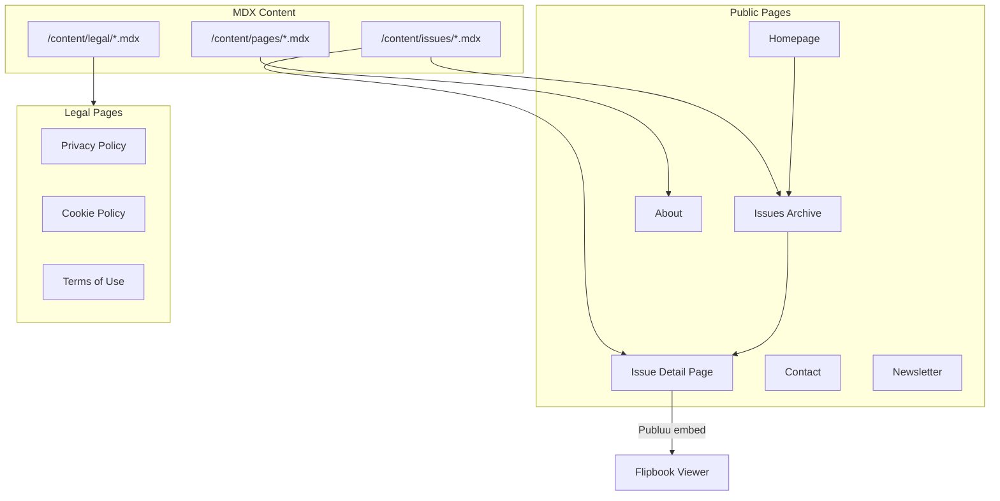

# Blue Mind Magazine - Premium Editorial Website

## Project Overview

A minimal, premium black-and-white editorial website for Blue Mind Magazine that showcases surf and science content. Each issue gets a unique accent color that dynamically themes the issue pages. Content will be managed via MDX files for easy migration to a CMS later.

## Brand Identity

- **Base Colors**: Black (#000000) + White (#FFFFFF)
- **Default Accent**: Dark Turquoise (#0097B2)
- **Typography**: League Gothic / Oswald (headlines), Open Sans (body), Telegraf (accents)
- **Style**: Minimal, editorial, premium - inspired by The Surfer's Journal

## Site Architecture



## Page Structure

| Page | Route (EN/PT) | Purpose |

|------|---------------|---------|

| Homepage | `/` / `/pt` | Hero, current issue, archive grid, newsletter CTA |

| Issue Detail | `/issues/[slug]` | Flipbook embed, highlights, sponsor logos |

| About | `/about` | Magazine, Chief Editor, Publisher, Supporters |

| Contact | `/contact` | Contact form (Resend), social links |

| Newsletter | `/newsletter` | Beehiiv subscription embed |

| Privacy | `/privacy` | GDPR-compliant privacy policy |

| Cookies | `/cookies` | Cookie policy |

| Terms | `/terms` | Terms of use |

## Content Structure (TypeScript Data Files)

Clean, type-safe data structure optimized for future CMS migration:

```
content/
├── data/
│   ├── issues.ts         # All issue data with full type safety
│   ├── sponsors.ts       # Sponsor/supporter data
│   ├── team.ts           # Team members (editor, publisher)
│   └── navigation.ts     # Nav links, social links
├── i18n/
│   ├── en/
│   │   ├── issues.ts     # Issue content translations
│   │   ├── pages.ts      # Page content (about, contact)
│   │   └── legal.ts      # Legal pages content
│   └── pt/
│       └── ...
└── types/
    └── content.ts        # Shared TypeScript types
```

## Issue Data Schema (TypeScript)

```typescript
// content/data/issues.ts
export const issues = [
  {
    id: 'issue-0',
    slug: 'issue-0-january-2026',
    issueNumber: 0,
    date: '2026-01-01',
    accentColor: '#0097B2',
    cover: '/images/issues/issue-0/cover.png',
    flipbook: {
      en: 'https://publuu.com/flip-book/1032681/2310890/page/1?embed',
      pt: 'https://publuu.com/flip-book/1032681/2310467/page/1?embed',
    },
    sponsors: ['surfing-medicine-international'],
    highlights: [
      {
        id: 'editors-note',
        page: 4,
        image: '/images/issues/issue-0/editors-note.jpg',
      },
      {
        id: 'meet-the-scientist',
        page: 12,
        image: '/images/issues/issue-0/meet-scientist.jpg',
      },
    ],
    sections: [
      'Meet the Scientist',
      "Student's Peak", 
      'Surf Science Explained',
      'Meet the Surfer',
      'Tips & Tricks',
      'Community Projects',
      'Surfing Medicine International'
    ],
  },
] as const;

// Translations in content/i18n/en/issues.ts
export const issueTranslations = {
  'issue-0': {
    title: 'Issue 0',
    subtitle: 'January 2026',
    description: 'Our inaugural issue exploring where surf and science meet...',
    highlights: {
      'editors-note': {
        title: "Editor's Note",
        author: 'Pedro Seixas, PT, PhD',
        excerpt: 'Surfing has always been more than a sport...',
      },
    },
  },
};
```

## Issue Detail Page Design (Inspired by The Surfer's Journal)

### Hero Section Layout

```
┌─────────────────────────────────────────────────────────────┐
│  [Background: Issue Accent Color]                           │
│                                                             │
│  ┌──────────────┐    ┌─────────────────────────────────┐   │
│  │              │    │  Current Issue:                  │   │
│  │   COVER      │    │  ══════════════════════════════  │   │
│  │   IMAGE      │    │  ISSUE 0                         │   │
│  │  (3D Tilt)   │    │  ──────────────────────────────  │   │
│  │              │    │  Description text here...        │   │
│  │              │    │                                  │   │
│  │  [Subscribe] │    │  [Preview Issue ↓]               │   │
│  │  [Read Now]  │    │                                  │   │
│  └──────────────┘    └─────────────────────────────────┘   │
└─────────────────────────────────────────────────────────────┘
```

### Features/Highlights Section

```
┌─────────────────────────────────────────────────────────────┐
│  FEATURES                                                   │
│  ═══════                                                    │
│                                                             │
│  ┌─────────────────────────────────────────────────────┐   │
│  │  [Full-width Feature Image]                          │   │
│  │                                                      │   │
│  │  Page 4                                              │   │
│  │  EDITOR'S NOTE                                       │   │
│  │  Surfing has always been more than a sport...        │   │
│  │  By Pedro Seixas, PT, PhD                            │   │
│  └─────────────────────────────────────────────────────┘   │
│                                                             │
│  ┌─────────────────────────────────────────────────────┐   │
│  │  [Full-width Feature Image]                          │   │
│  │  Page 12 | MEET THE SCIENTIST | ...                  │   │
│  └─────────────────────────────────────────────────────┘   │
└─────────────────────────────────────────────────────────────┘
```

### CTA + Sponsor Block

```
┌─────────────────────────────────────────────────────────────┐
│  [Accent Color Background]                                  │
│                                                             │
│  "Where surf & science meet, delivered to your inbox."      │
│                        [Subscribe]                          │
│                                                             │
├─────────────────────────────────────────────────────────────┤
│  Supported by:                                              │
│  [SMI Logo]  [Sponsor 2]  [Sponsor 3]                       │
└─────────────────────────────────────────────────────────────┘
```

## Key Components to Build

| Component | Description |

|-----------|-------------|

| `Header` | Logo, nav, language switcher, mobile menu |

| `Footer` | Newsletter signup, social links, legal links |

| `IssueCard` | 3D tilt cover with Motion, title, date, accent color border |

| `IssueHero` | Full-width hero with cover, flipbook CTA |

| `FlipbookViewer` | Publuu iframe embed with fullscreen option |

| `HighlightCard` | Article preview with image, title, excerpt |

| `SponsorGrid` | Logo grid for issue/global sponsors |

| `ContactForm` | Form with Resend integration |

| `NewsletterForm` | Beehiiv embed/integration |

| `CookieBanner` | c15t-powered GDPR consent banner |

| `LanguageSwitcher` | EN/PT toggle |

| `JsonLd` | Reusable JSON-LD structured data injector |

| `SeoHead` | Dynamic meta tags and OG image configuration |

| `TiltCard` | Reusable 3D tilt wrapper component using Motion |

| `FeatureCard` | Full-width article highlight card (TSJ-inspired) |

## Technical Implementation

### Files to Create/Modify

**Routing & Layout:**

- `[app/[locale]/layout.tsx](app/[locale]/layout.tsx)` - Update with brand fonts, theme system
- `app/[locale]/issues/page.tsx` - Issues archive
- `app/[locale]/issues/[slug]/page.tsx` - Issue detail
- `app/[locale]/about/page.tsx` - About page
- `app/[locale]/contact/page.tsx` - Contact form
- `app/[locale]/newsletter/page.tsx` - Newsletter
- `app/[locale]/(legal)/privacy/page.tsx` - Privacy policy
- `app/[locale]/(legal)/cookies/page.tsx` - Cookie policy
- `app/[locale]/(legal)/terms/page.tsx` - Terms of use

**API Routes:**

- `app/api/contact/route.ts` - Contact form handler (Resend)
- `app/api/og/route.tsx` - Dynamic OG image generation (Vercel OG)
- `app/api/og/issue/[slug]/route.tsx` - Issue-specific OG images

**SEO & Technical:**

- `app/sitemap.ts` - Dynamic XML sitemap with hreflang
- `app/robots.ts` - Robots.txt configuration
- `lib/metadata.ts` - Centralized metadata utilities
- `lib/schema.ts` - JSON-LD structured data generators
- `lib/c15t-config.ts` - Cookie consent configuration

**Translations:**

- [`messages/en.json`](messages/en.json) - Expand with all UI strings
- `messages/pt.json` - Portuguese translations

**Content (TypeScript Data):**

- `content/data/issues.ts` - All issues with type-safe schema
- `content/data/sponsors.ts` - Sponsors/supporters data
- `content/data/team.ts` - Team members (editor, publisher)
- `content/i18n/en/issues.ts` - English issue translations
- `content/i18n/pt/issues.ts` - Portuguese issue translations
- `content/i18n/en/pages.ts` - English page content (about, contact)
- `content/i18n/pt/pages.ts` - Portuguese page content
- `content/types/content.ts` - Shared TypeScript types

**Styling:**

- [`app/globals.css`](app/globals.css) - Update with brand colors, accent color system
- `lib/get-issue-theme.ts` - Dynamic accent color utility

## Design Approach

The website will feature:

1. **Dark mode by default** - Black background with white typography
2. **Dynamic accent colors** - Each issue page loads CSS variables based on issue's accent color
3. **Editorial typography** - Large headlines (League Gothic), readable body (Open Sans)
4. **Cinematic imagery** - Full-bleed cover images, parallax effects
5. **Subtle animations** - Page transitions, hover states, scroll reveals using Motion library
6. **Magazine-style layouts** - Grid-based, generous whitespace, strong visual hierarchy
7. **3D Issue Cards** - Perspective tilt effect on hover using Motion

## 3D Issue Card Animation (Motion)

Using the already-installed `motion` library for a premium 3D tilt effect on issue cover cards:

```tsx
// components/issue-card.tsx
'use client';

import { motion, useMotionValue, useSpring, useTransform } from 'motion/react';

export function IssueCard({ issue }: { issue: Issue }) {
  const x = useMotionValue(0);
  const y = useMotionValue(0);

  // Smooth spring physics
  const mouseXSpring = useSpring(x, { stiffness: 150, damping: 15 });
  const mouseYSpring = useSpring(y, { stiffness: 150, damping: 15 });

  // Transform mouse position to rotation
  const rotateX = useTransform(mouseYSpring, [-0.5, 0.5], ['8deg', '-8deg']);
  const rotateY = useTransform(mouseXSpring, [-0.5, 0.5], ['-8deg', '8deg']);

  // Glare/shine effect position
  const glareX = useTransform(mouseXSpring, [-0.5, 0.5], ['0%', '100%']);
  const glareY = useTransform(mouseYSpring, [-0.5, 0.5], ['0%', '100%']);

  const handleMouseMove = (e: React.MouseEvent) => {
    const rect = e.currentTarget.getBoundingClientRect();
    const xPos = (e.clientX - rect.left) / rect.width - 0.5;
    const yPos = (e.clientY - rect.top) / rect.height - 0.5;
    x.set(xPos);
    y.set(yPos);
  };

  const handleMouseLeave = () => {
    x.set(0);
    y.set(0);
  };

  return (
    <motion.article
      onMouseMove={handleMouseMove}
      onMouseLeave={handleMouseLeave}
      style={{
        rotateX,
        rotateY,
        transformStyle: 'preserve-3d',
      }}
      className="relative cursor-pointer"
    >
      {/* Card with perspective */}
      <div style={{ perspective: '1000px' }}>
        {/* Cover image with slight float effect */}
        <motion.img
          src={issue.cover}
          alt={issue.title}
          style={{ translateZ: '30px' }}
          className="w-full shadow-2xl"
        />
        
        {/* Glare overlay */}
        <motion.div
          style={{
            background: `radial-gradient(circle at ${glareX} ${glareY}, rgba(255,255,255,0.15), transparent)`,
          }}
          className="absolute inset-0 pointer-events-none"
        />
      </div>
      
      {/* Issue info below card */}
      <div className="mt-4 text-center">
        <h3 className="font-bold">{issue.title}</h3>
        <time className="text-muted-foreground">{issue.date}</time>
      </div>
    </motion.article>
  );
}
```

**Effects included:**

- Mouse-tracking perspective tilt (8deg max)
- Spring physics for smooth, natural movement
- Subtle glare/shine effect following cursor
- Cover image "floats" slightly above card (translateZ)
- Smooth return to rest position on mouse leave
- Works on both homepage grid and issue archive

## Third-Party Integrations

| Service | Purpose | Implementation |

|---------|---------|----------------|

| Publuu | Flipbook viewer | iframe embed |

| Beehiiv | Newsletter | Embed form or API |

| Resend | Contact form emails | API route |

| c15t | Cookie consent | `@c15t/nextjs` provider |

| Vercel OG | Dynamic social images | `@vercel/og` API routes |

## SEO, Structured Data & Technical SEO

### Semantic HTML Structure

All pages will use proper semantic HTML5 elements:

```html
<header> - Site header with navigation
<nav> - Primary and footer navigation
<main> - Main content area
<article> - Issue pages, blog posts
<section> - Page sections with headings
<aside> - Sidebar content, related issues
<footer> - Site footer
<figure>/<figcaption> - Images with captions
<time datetime=""> - Publication dates
<address> - Contact information
```

### JSON-LD Schema.org Structured Data

| Page Type | Schema.org Type | Key Properties |

|-----------|-----------------|----------------|

| Homepage | `WebSite`, `Organization` | name, url, logo, sameAs (social), potentialAction (search) |

| Issue Page | `Periodical`, `PublicationIssue` | issueNumber, datePublished, publisher, about |

| About Page | `AboutPage`, `Person`, `Organization` | Chief Editor, Publisher, Supporters |

| Contact | `ContactPage` | email, telephone, address |

| Article/Highlight | `Article`, `ScholarlyArticle` | author, datePublished, publisher, about |

**Example JSON-LD for Issue Page:**

```json
{
  "@context": "https://schema.org",
  "@type": "PublicationIssue",
  "issueNumber": "0",
  "datePublished": "2026-01-01",
  "isPartOf": {
    "@type": "Periodical",
    "name": "Blue Mind Magazine",
    "issn": "...",
    "publisher": {
      "@type": "Organization",
      "name": "Surfisio",
      "url": "https://surfisio.pt"
    }
  },
  "about": ["Surfing", "Sports Science", "Ocean Health"]
}
```

### Vercel OG Images & Meta Tags

- **Dynamic OG Images**: Use `@vercel/og` (already installed) to generate dynamic social share images
- **Per-Issue OG Images**: Generate branded images with issue cover, title, and accent color
- **Meta Tags**: Complete Open Graph and Twitter Card meta tags for all pages

**Files to create:**

- `app/api/og/route.tsx` - Dynamic OG image generation
- `app/api/og/issue/[slug]/route.tsx` - Issue-specific OG images
- `lib/metadata.ts` - Centralized metadata generation utilities

### Sitemap & Robots.txt

**`app/sitemap.ts`** - Dynamic sitemap generation:

```typescript
// Generates sitemap with:
// - All static pages (homepage, about, contact, legal)
// - All issue pages with lastmod dates
// - Alternate hreflang links for EN/PT
// - Priority weighting (homepage: 1.0, issues: 0.8, legal: 0.3)
```

**`app/robots.ts`** - Robots.txt configuration:

```typescript
// Allows all crawlers
// Points to sitemap
// Disallows /api/ routes
// Disallows /_next/ internal routes
```

### Hreflang & Internationalization SEO

- Proper `<link rel="alternate" hreflang="en">` tags
- Canonical URLs for each language version
- `x-default` hreflang pointing to English version
- Language-specific metadata (titles, descriptions)

### LLM-Friendly Content

- Clear, descriptive headings (H1-H6 hierarchy)
- Alt text on all images describing content
- Structured content with lists and tables where appropriate
- FAQ schema on relevant pages
- Clear article structure with intro, body, conclusion

## Cookie Consent (c15t)

Using `@c15t/nextjs` for GDPR-compliant cookie consent:

**Configuration:**

- Categories: Essential, Analytics, Marketing
- Geolocation-aware (stricter for EU visitors)
- Remembers user preferences
- Integrates with analytics conditionally

**Files to create/modify:**

- `app/[locale]/layout.tsx `- Add `<C15tProvider>`
- `lib/c15t-config.ts` - Cookie consent configuration
- Style to match brand (black/white theme)

## Legal & Compliance

- Cookie consent banner via c15t (GDPR-compliant)
- Privacy policy (GDPR-compliant, covers newsletter, analytics)
- Cookie policy (explains what cookies are used)
- Terms of use (content rights, disclaimers)
- Accessibility (alt texts, keyboard nav, contrast ratios, WCAG 2.1 AA)